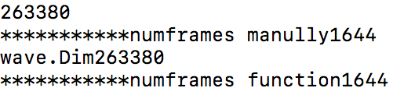
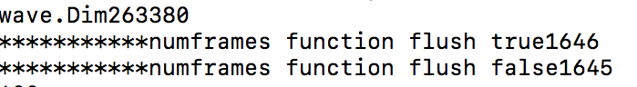
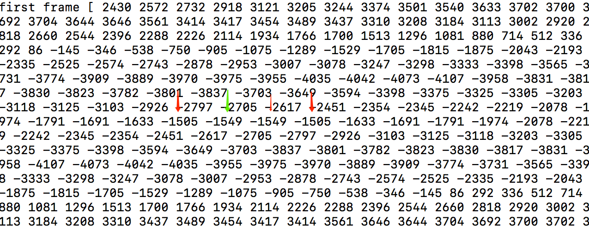
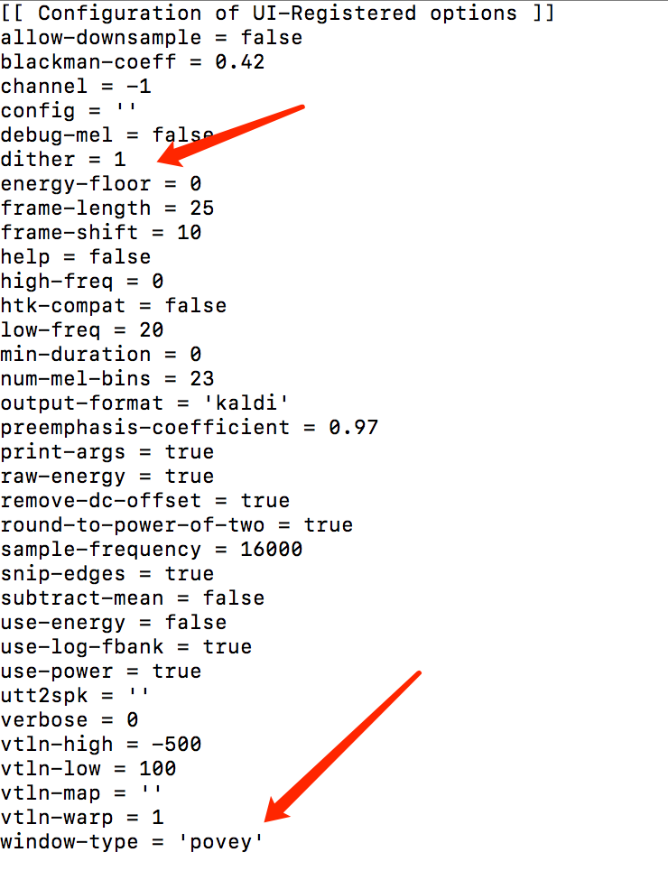
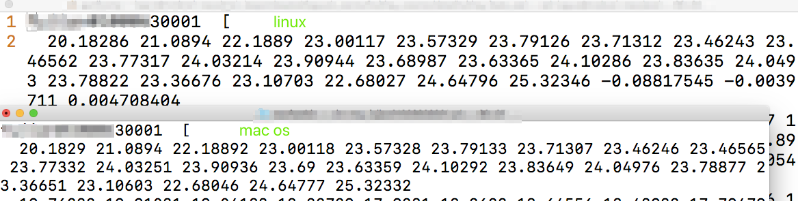
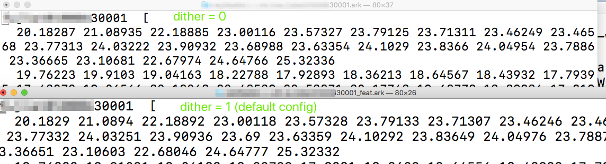
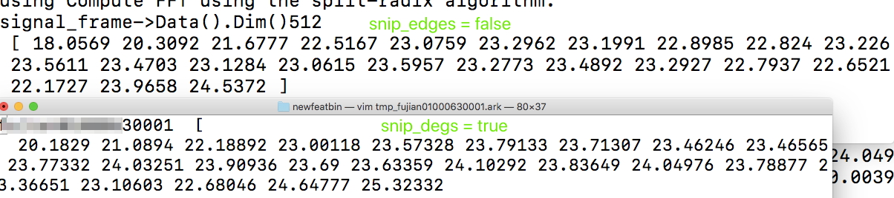
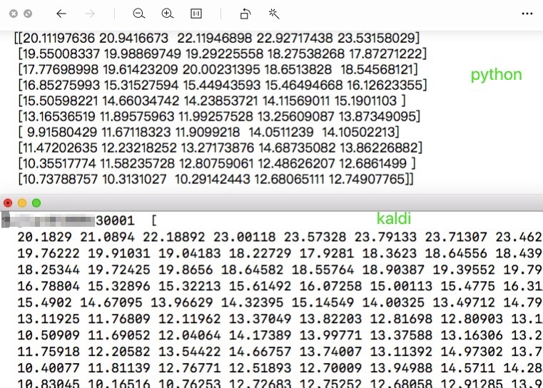

#kaldi fbank特征提取

1. 分帧： 包含计算每个frame的起止点，以及总共多少个frames,以及如何填充零前时刻和终止后的时刻  
    计算number of frames 和各个frame 包含的采样点（sample）  
    分析代码：kaldi/src/feat/feature-window.cc
   ```
   #计算第一帧的起点 函数 FirstSampleOfFrame
   #suppoose rate = 16k, opots.WindowSize() = 400 (25 ms) frame_shift = 160 (10 ms)
   int64 FirstSampleOfFrame(int32 frame,
                            const FrameExtractionOptions &opts) {
      int64 frame_shift = opts.WindowShift();
      if (opts.snip_edges) {
        #第一帧以wave 中第一个sample pcm 为起点，每次往后移动frame_shift
        return frame * frame_shift;
      } else {
        #第一帧的mindpoint_of_frame = 160*0 + 160/2 = 80为起点
        # beginning_of_frame = 80 - 400/2 = -120
        #因此第一帧左边要补上120个pcm点，kaldi中采用的是 reflection 填充方式
        #详见 ExtractWindow 函数
        int64 midpoint_of_frame = frame_shift * frame  +  frame_shift / 2,
            beginning_of_frame = midpoint_of_frame  -  opts.WindowSize() / 2;
        return beginning_of_frame;
      }
   }
    ``` 
    ```
    #分析number of frames 函数 NumFrames
    #num of pcms = 263380 
    #num of frames = 1644 when snip_edges = true
    (263380-400)/160 = 1643.25 = 1643
    1 + 1643 = 1644
    #num of frames = 1646 when snip_edges = false
    #with flush = true (263380 + (160/2))/160 = 1646.625 = 1646 (看似kaldi 的文档和代码有一点出入
    #主要在we add (half the frame-shift minus epsilon) before dividing, to have the effect of
    #rounding to the closest integer.)
    #但是代码中并没有minus epsilon
    #anyway, 最终还是通过在num_frames后 加上 （frame_shift /2） 实现了round to nearest integer的效果
    #在本例中， snip_edges = false, 实现了num_frames为（file-length / frame-shift） to the nearest integer
    
    #with flush = false 
    #we can't outpout frames that extend past the end of the signal
    #所以最后一个frame的最后一个sample pcm必须在wav 中
    #num_frames = 1646 -> end_sample_of_last_frame = FirstSampleOfFrame(1646 -1, opts)+frame_length
                  = (160*1645 + 80 -200) + 400 = 263480 > num of pcms = 263380
                  
                 1646 - 1  = 1645 -> end_sample_of_last_frame = 263480 - 160 = 263320 < num of pcms = 263380
     所以num_frames = 1645
    ```
   snip_edges = true
     
   snip_edges = false
   
   
   ```
   从wav 中抽取一个frame 函数 ExtractWindow
   对于snip_edges = true 比较简单，因为不牵扯到对于 负时刻的填充，所有的frame 都在wav 中
   with --snip-edges = true (the default), we use a HTK-like approach to
   determining the number of frames -- all frames have to fit completely into the 
   waveform, and the first frame begins at sample zero
   一般最后剩余的不够一个frame 的会丢掉
   
   对与snip_edges = false, 要对小于零时刻或者（当flush = true 还可能要对大于 num pcms 的值）进行填充
   kaldi 采用的是镜像填充 reflection
   
    ```
   reflection padding：the first frame with shift = 160, window = 400 so there are   
   80 - 200 = -120 pcms before zero sample pcm  
   the reflectin point is 121 (which is the first sample pcm in wave)  
   
   Note: how to interpret snip_edge?  
   snip 是剪掉的意思。当我们从zero sample 开始第一个frame时，究竟什么被剪掉了？    
   Maybe an answer: 当从zero sample 开始时，  
   midpoint = 200, 最核心的160个pcm 为从 120 到280，  
   第二个frame shift 160,  
   midpoint = 360, 最核心的160个pcm 为从 280 到440   
   第三个frame又shift 160,   
   midpoint = 520, 最核心的160个pcm 为从 440 到600  
   。。。  
   可以看到每个pcm 都有处在核心的机会，除了wav 最开始的120个pcm  
   这120个初始的边缘pcm被"剪掉了"，大概这就是"snip edge"的来源吧
   
2. 处理每一帧 函数 ProcessWindow  
    2.1.加随机扰动 函数Dither 
    2.2.去直流分量  
    ```
    if (opts.remove_dc_offset)
      window->Add(-window->Sum() / frame_length);
    ```
    //求加窗前的log energy: 即该frame 的dot product 取log(是另外单独的特征)
    
    2.3.预加重 函数Preemphasize 类似于求导数，减去前时刻的preemph_coeff倍
    ```
    for (int32 i = waveform->Dim()-1; i > 0; i--)
        (*waveform)(i) -= preemph_coeff * (*waveform)(i-1);
    (*waveform)(0) -= preemph_coeff * (*waveform)(0);
    
    #python 实现：在此处实现过程中犯了一个严重的错误,在提取subtrahend,
    应该拿第一列到倒数第二列，即first_to_penultimate
    实际上取的是从第一列到最后一列，即数组本身，所以预加重的结果只不过是自己减去自己的
    coeff, 相当于缩小了（1-coeff）倍。
    正确的代码如下：
    def preemphasis(signal, coeff=0.95):
    """perform preemphasis on the input signal.
    :param signal: The signal to filter.
    :param coeff: The preemphasis coefficient. 0 is no filter, default is 0.95.
    :returns: the filtered signal.
    """
    first_to_penultimate = signal[:,:-1]
    first=np.reshape(signal[:,0],[signal.shape[0],1])
    subtrahend =np.hstack([first,first_to_penultimate])
    pre=signal- coeff * subtrahend
    return pre
    #return np.concatenate(tmp[:][0], tmp,axis=1)
    ```
    2.4.加窗
    ```
     window->MulElements(window_function.window);

    ```
    窗函数：
    ```
    
    povey
    window(i) = pow(0.5 - 0.5*cos(a * i_fl), 0.85);
    对应的python 
    i_fl = np.array(range(0,400,1))
    M_2PI = 6.283185307179586476925286766559005
    a = M_2PI / (frame_length-1)
    window = pow(0.5 - 0.5*np.cos(a * i_fl), 0.85)
    
    hamming
    window(i) = 0.54 - 0.46*cos(a * i_fl);
    对应的python
    i_fl = np.array(range(0,400,1))
    M_2PI = 6.283185307179586476925286766559005
    a = M_2PI / (frame_length-1)
    window = 0.54 - 0.46*np.cos(a * i_fl)
    len(window)
    
    补零 fft变换的点为512，当frame 长度不够时（如本例中的400），补零
    定义窗的长度是 512
    if (window->Dim() != frame_length_padded)
        window->Resize(frame_length_padded, kUndefined);
    
    不够的补零
    if (frame_length_padded > frame_length)
        window->Range(frame_length, frame_length_padded - frame_length).SetZero();
        
    补的零不参与ProcessWindow 函数处理，
    注意slice 是从0到frame_length而不是window的总长度frame_length_padded
    SubVector<BaseFloat> frame(*window, 0, frame_length);
    ProcessWindow(opts, window_function, &frame, log_energy_pre_window);
    ```
3. fbank 提取  
    3.1 kaldi fbank 分析
    
    ```
    kaldi 提取fbank，其作者dan povey 设计了一个窗函数，在默认配置中，
    使用了这个窗函数。kaldi 提取fbank的默认配置见下图
    在compute-fbank-feats.cc 加入输出config 到std::cout 的命令
    // parse options (+filling the registered variables)
    po.Read(argc, argv);
    po.PrintConfig(std::cout);
    
    默认的dither=1，然而即使相同的dithter 参数，该函数在不同的机器（linux-maryland 和 mac os）上加的随机数不一样
    如果将dither值都设置为0， 则linux-maryland机器上和mac os 上的到的结果是一样的
    
    ./compute-fbank-feats --dither=0 scp:fujian01000630001_wav.scp ark,t:tmp_fujian01000630001.ark
    
    默认的是snip_edges = true , 所以first frame 的 start sample 是从zero sample 开始的 
    
    conclusion:
    需要注意的点有：
    1.snip_edges =true or false
    2.dither = 1 or 0
    3.不同的系统产生的随机数不同，虽然都是正太分布随机数 
     

    ```
    kaldi 提取fbank的默认配置
    
    
    kaldi fbank default config linux and mac
    
    macos 系统 fbank dither=0 vs fbak dither=1
    
    snip_edegs_true_and_false对比 macos 系统
    

     上面三幅图的第二行都是macos 系统上 kaldi 默认fbank
     （snip_edges=true, dither=1, fft_point=512 ）
     
     3.2. python 复现kaldi fbank
     主要为两步，计算power spectrum
     坑点有两个，
     a. kaldi 计算power spectrum 是numpy的512倍，即fft点的个数
     
     b. kaldi 应该是加速了 power spectrum 与 filter banks矩阵相乘的过程，
        从src/matrix/srfft.cc文件来看，确实如此
        导致与numpy计算出来的filter banks 有出入
        但是最终的fbanks 差异不大。具体数值见下图
     
     
